# Captive Portal Setup

A captive portal is an important part of network access control in an enterprise environment. Users who connect to the network must authenticate with credentials such as a username, password, or voucher code before they can access network services.

---

## Prerequisites

- pfSense installed
- pfSense VLAN created

## Setup

1. Log in to your pfSense dashboard.
2. Click the menu.
3. Click Services.
4. Click Captive Portal.

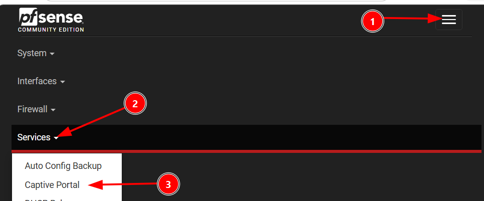

5. Click Add.

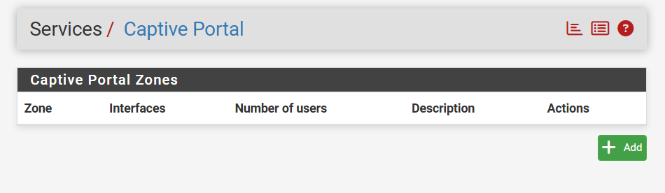

6. Enter a zone name, for example Human_Res.
7. Enter a zone description, for example Zone for Human-Res staff.
8. Click Save and Continue.

.png)

9. Check Enable Captive Portal.
10. In Interface, select HumanRes.

> Note: Repeat this process for the LAN interface you are currently connected to.

pfSense provides clear descriptions for each option. Because enterprise environments vary, adjust the settings to suit your environment.

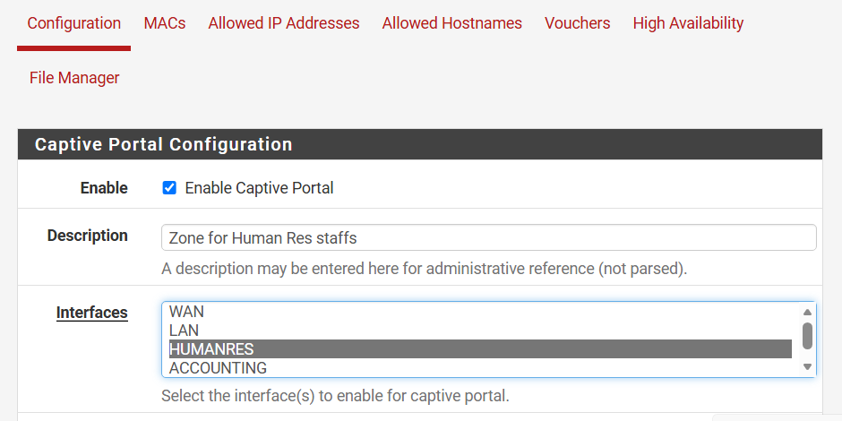

11. Set Idle Timeout to 30.
12. Check Logout Popup Window.
13. Set After Authentication URL to https://www.google.com.
14. Check Preserve User Database.
15. Leave Concurrent Connection at the default value.
16. Check Enable Per-user Bandwidth Restriction.
17. Set Default Download to 1024 kbit/s (about 1 Mbps).
18. Set Default Upload to 1024 kbit/s (about 1 Mbps).
19. Leave the Authentication Method as the default.
20. Select Local Database for the Authentication Server.
21. Select Local Database for the Secondary Authentication Server.
22. Click Save.
23. Repeat the process for each VLAN segment.

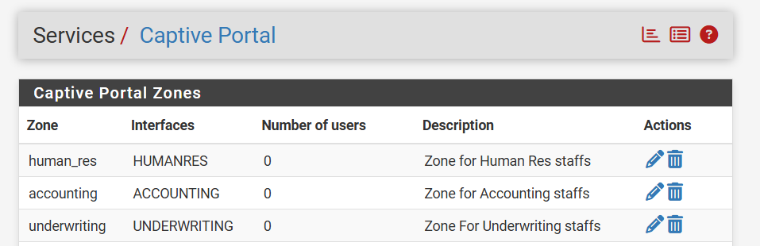

## Creating User Accounts for Different Segments

1. Click the menu.
2. Click System.
3. Click User Manager.

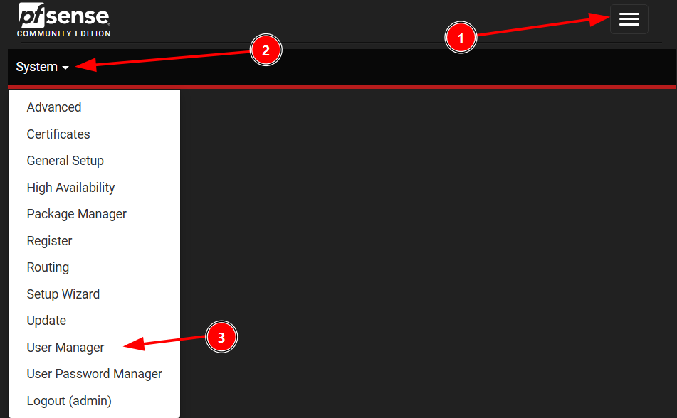

### Create Groups

1. Click Groups.
   - Groups help apply configuration settings to all users in the group instead of configuring each user individually.
2. Click Add.

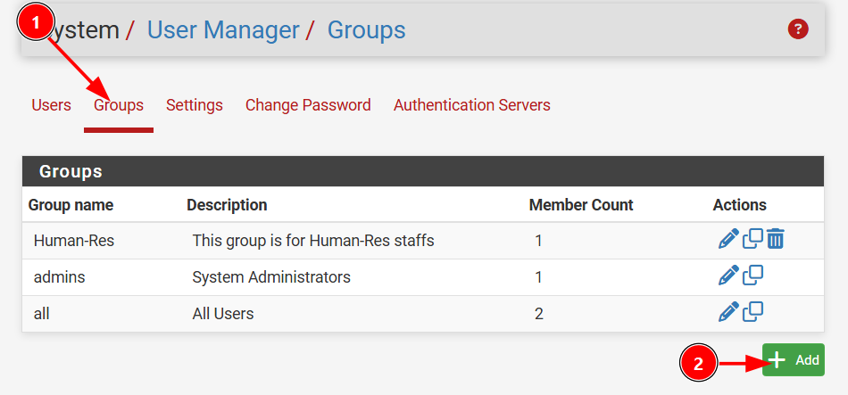

3. Enter a group name.
4. Enter a description.

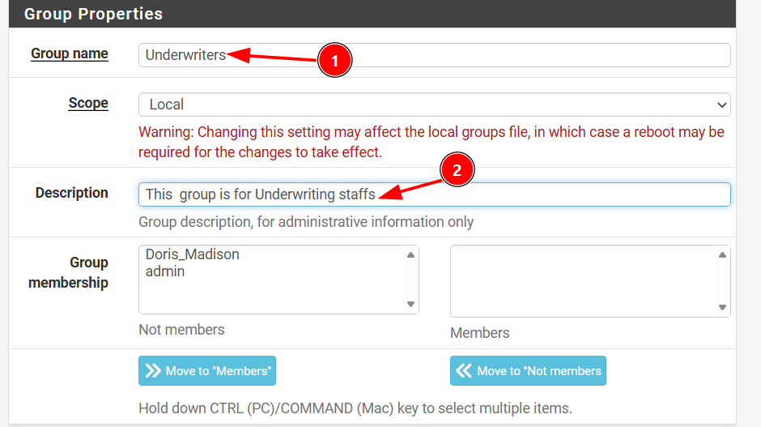

5. In the Assigned Privileges section, click Add.
   - This is important. Without it, the accounts you create may be denied access or rejected.
6. Select User-Service: Captive Portal.

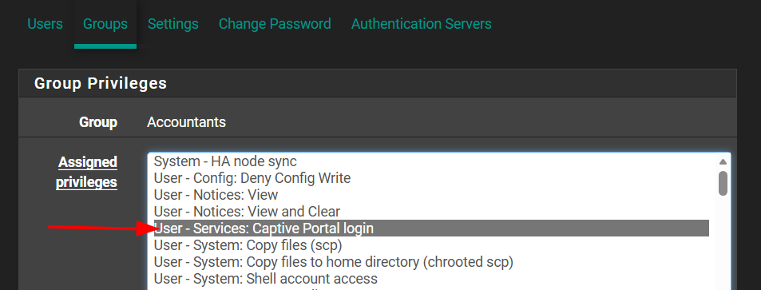

7. Click Save.
8. Repeat this for each additional group.

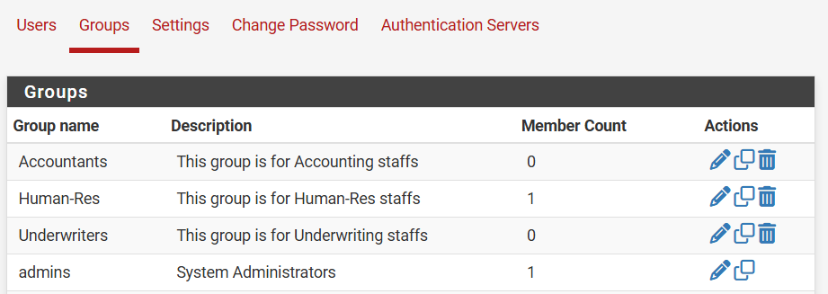

Example users:
- Victoria Dane - Accounting
- Doris Madison - Human-Res
- Tolu Anderson - Underwriter

## Creating User Accounts

1. Click User.
2. Click Add.
3. Enter a username.
4. Enter a password.
5. Enter the full name.

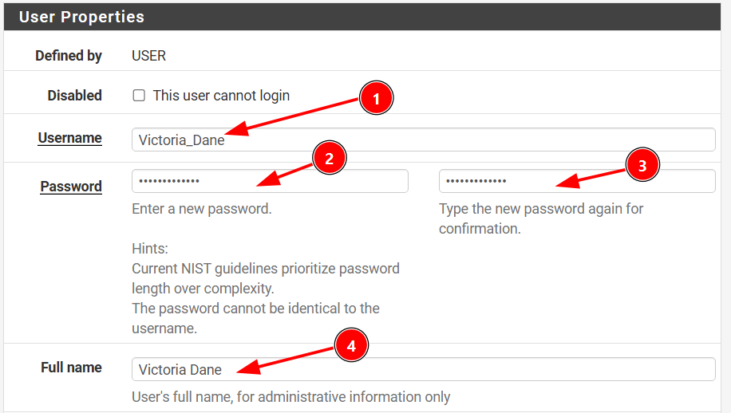

Make sure to add each user to the correct group by selecting the group and clicking Move to Members List.

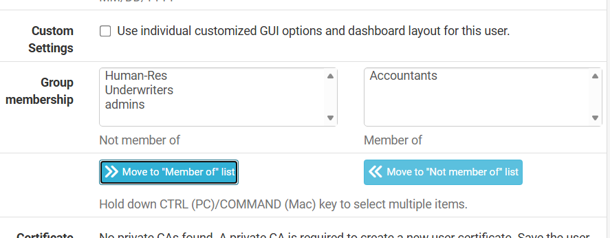

Repeat this for the other users.

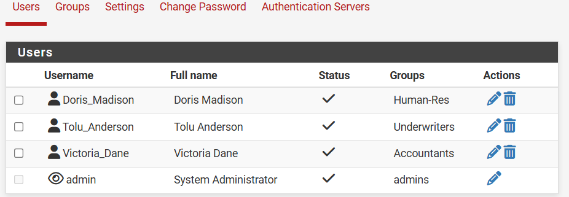

When everything is configured, you should see the captive portal page in your browser.

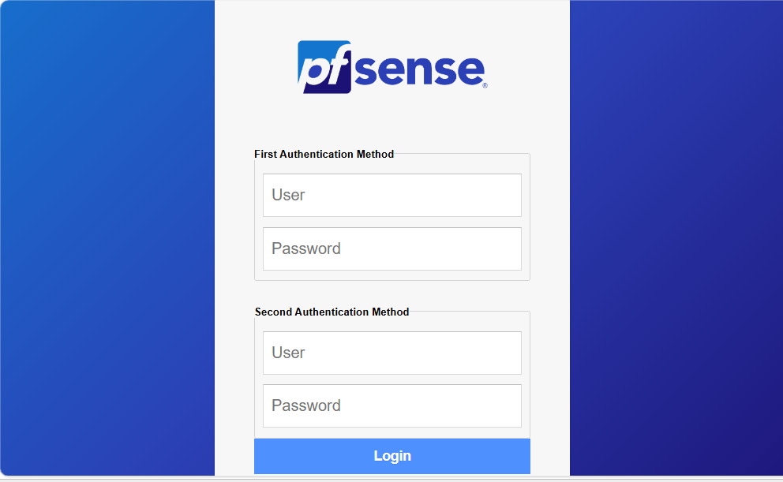

## Confirmation

Test the user account using one of the authentication methods.

### Before Login

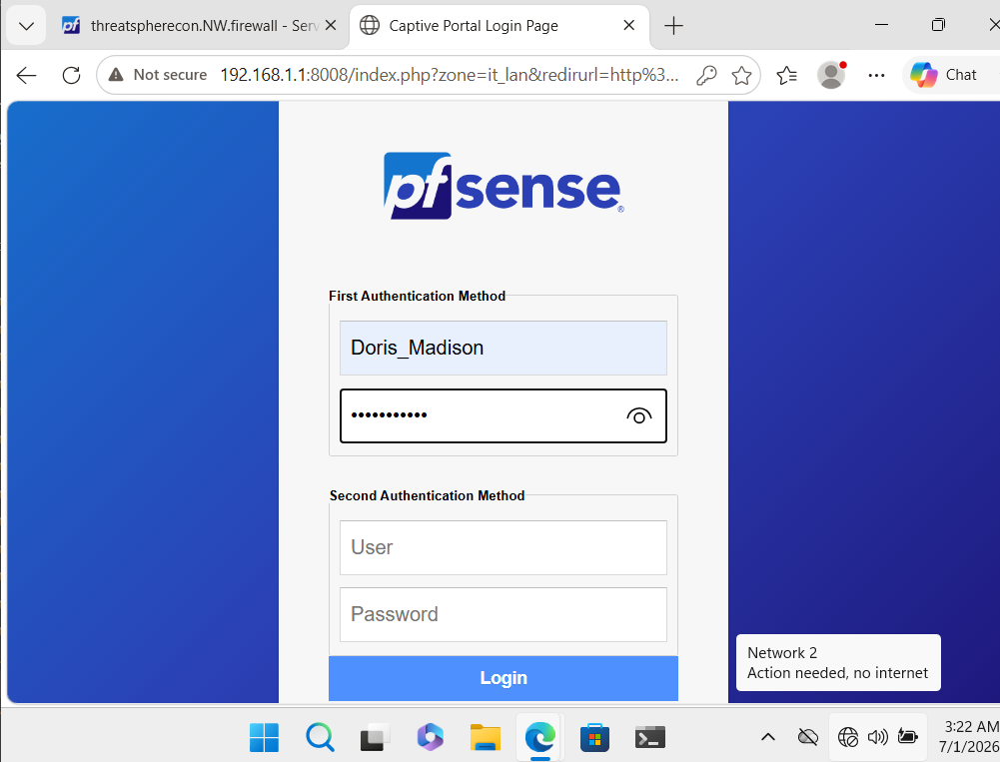

### After Login

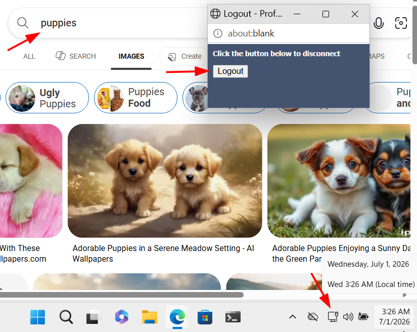

You should see the logout popup window.

### Captive Portal Access Logs

1. Click the menu.
2. Click Status.
3. Click Captive Portal.
4. Select the zone.
5. Review the active users.

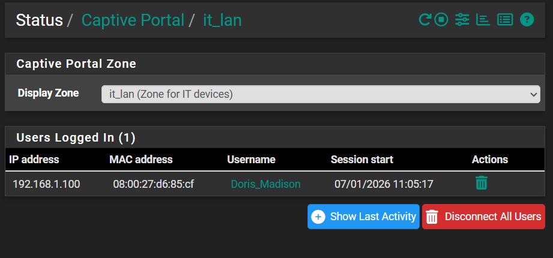

### Note

This is the default captive portal on pfSense. It works well for basic use, but it is not custom. For a custom setup, see [this repository](https://github.com/eth-hac-steven/Fortify-Continuum-Network-infrastructure/tree/main/Fortify%20Continuum%20Captive-Portal).
